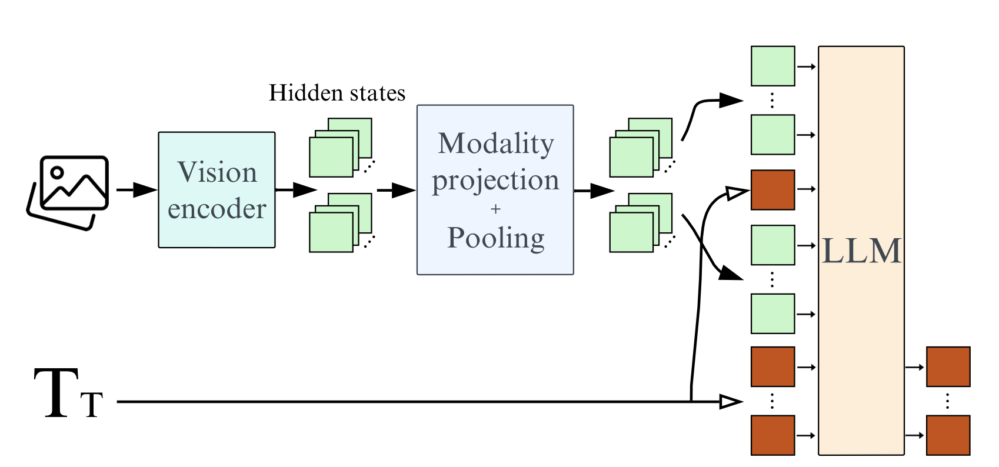
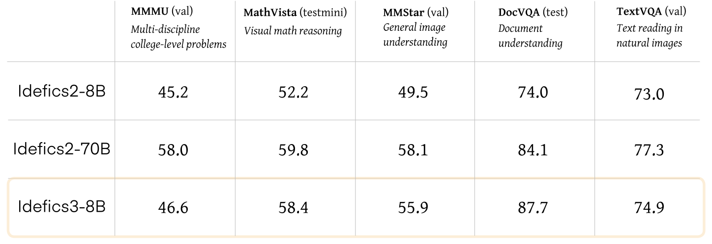
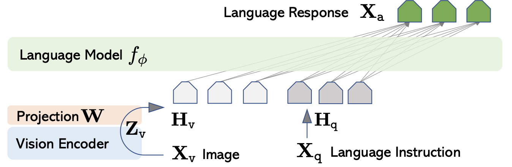

# Visual Question Answering

## Table of Contents
- [Visual Question Answering](#visual-question-answering)
  - [Table of Contents](#table-of-contents)
  - [Introduction](#introduction)
  - [VQA](#vqa)
  - [Evaluation Benchmarks](#evaluation-benchmarks)
    - [Benchmarks](#benchmarks)
    - [Augmented VQA](#augmented-vqa)
    - [Wu-Palmer Similarity](#wu-palmer-similarity)
  - [Basic Implementation Of VLM](#basic-implementation-of-vlm)
    - [Motivation](#motivation)
    - [Architecture](#architecture)
    - [Code](#code)
    - [Performance](#performance)
  - [Idefics3](#idefics3)
    - [Motivation](#motivation-1)
    - [Architecture](#architecture-1)
    - [Code](#code-1)
    - [Performance](#performance-1)
  - [LLAVA](#llava)
    - [Motivation](#motivation-2)
    - [Architecture](#architecture-2)
    - [Code](#code-2)
    - [Performance](#performance-2)
  - [Results](#results)
  - [Demo](#demo)
  - [Similar Works](#similar-works)
  - [Conclusion](#conclusion)
  - [Future Work](#future-work)
  - [References](#references)

## Introduction
**(Open-answer) visual question answering (VQA** for short) is a computer vision task to: given an image and a natural-language question about the image, return an accurate and human-like natural-language response to the query using information in the image. Formally, the open-answer VQA task is: given an image-question pair `(I, q)`, output a sequence of characters `s` (of arbitrary length).


Fig: An illustration of the VQA task [de Faria]

As a task, VQA is notable in that it extends existing vision/NLP tasks (e.g. image captioning, textual Q&A) by requiring multi-modal knowledge across two separate domains (image & natural language). Due to the open-endedness of VQA questions, a performant VQA model must have the capabilities to correctly answer a vast array of possible input queries across many different domains. This requires both a deep image understanding (as in image captioning) and a deep textual understanding (as in textual Q&A); however, it additionally requires the ability to combine knowledge across both domains to successfully answer questions. In this sense, VQA represents a “next step forward” in terms of building a compelling and challenging AI task.


Fig: Aspects of the VQA task [Kafle]

In particular, a key challenge in VQA is the requirement of common-sense reasoning. For example: to answer questions such as “Does this person have 20/20 vision?” and “Is this person expecting company” (pictured below), a VQA model must be able to both identify and extract the requisite information from relevant aspects of the image, reflecting a deeper notion of image understanding compared to previous image tasks.


Fig: Reasoning tasks in VQA [Antol]

## VQA
Most VQA architectures consist of two components -- an ***encoder*** and a ***decoder*** -- that perform the following sequence of steps:
1. ***Encoder***:
    - **Feature extraction**: Extracts features from the image and natural-language inputs to compute text & image embeddings
    - **Multimodal fusion**: Obtains a joint embedding from the image & text embeddings via a fusion method
2. ***Decoder***: Generates a natural-language response from the joint text & image embedding

In particular, most modern VQA models use a vision backbone (e.g. ResNet, ViT) and text encoder (e.g. Transformer) to compute separate image and text embeddings, then concatenate them to form a joint embedding. This joint embedding is then passed to a large language model/LLM to output the final vector. 


# Encoder

The encoder transforms raw inputs (image and text) into vector representations:

## Feature Extraction:

- **Vision Backbone (e.g., ViT):** Splits the image into patches and processes them with self-attention layers, producing a sequence of image embeddings.
  
- **Text Encoder (e.g., BERT):** Tokenizes and encodes the question into contextual embeddings.

Mathematically, if $I$ is an image and $q$ is the question:

$$
\mathbf{V} = \text{ViT}(\mathbf{I}) \in \mathbb{R}^{N \times d}, \quad \mathbf{W} = \text{BERT}(q) \in \mathbb{R}^{M \times d}
$$

## Multimodal Fusion

A fusion layer combines image and text embeddings into a single representation:

$$
\mathbf{F} = f(\mathbf{V}, \mathbf{W}) \in \mathbb{R}^{d'}
$$

Often, a linear projection or cross-attention is used.

## Decoder

A language decoder (e.g., GPT-2) generates the answer token-by-token from the fused representation:

$$
P(s|\mathbf{F}) = \prod_{t} P(s_t \mid s_{<t}, \mathbf{F})
$$


# Evaluation Benchmarks

Standard datasets like VQA v2 and GQA are used. Models are measured by accuracy against ground-truth answers.

## Augmented VQA & Wu-Palmer Similarity

Exact string matching is simplistic. Augmenting with Wu-Palmer similarity (WUP) from WordNet provides a semantic measure. The WUP score between two words $a, b$ is:

$$
\text{WUP}(a,b) = \max_{x \in S(a), y \in S(b)} \text{wupsimilarity}(x,y)
$$

where $S(a), S(b)$ are sets of synsets for $a, b$.

## Basic Implementation of VLM

### Motivation

### Architecture
A simple pipeline:

- Text Encoder (BERT)
- Image Encoder (ViT)
- Fusion layer (FC + ReLU)
- Classifier or Language Decoder

#### Vision Encoder

We utilize Vision Transformer (ViT) as the backbone for image feature extraction. ViT splits images into patches and applies the Transformer architecture directly to these patches, enabling efficient computation and scalability. The encoder outputs a high-dimensional feature vector representing the image.

**Model Used**: google/vit-base-patch16-224

#### Text Encoder

For the text encoder, we use BERT (Bidirectional Encoder Representations from Transformers). BERT generates a contextual embedding for the question by considering bidirectional relationships between words.

**Model Used**: bert-base-uncased

#### Multimodal Fusion

A fully connected layer is used to combine the vision and text embeddings. The fused representation enables the decoder to utilize both modalities effectively.

#### Language Decoder

The GPT-2 language model generates the natural language response. The decoder takes the fused multimodal embeddings as input and produces the answer in a token-by-token manner.

**Model Used**: gpt2

#### Implementation Details

The VQA model is implemented in PyTorch using the Transformers library. Key steps:

**Preprocessing**:

Images are resized and converted into tensor format using a feature extractor.

Questions are tokenized into embeddings.

**Forward Pass**:

Vision and text features are extracted using ViT and BERT.

Features are fused using a linear layer.

The fused embeddings are passed into GPT-2 for answer generation.

#### Results

Currently, the model is in its basic implementation phase. Preliminary results indicate that the architecture is functional, with generated answers being syntactically coherent but requiring fine-tuning for better accuracy.

Below are some example results of the VQA model on test images. Each image includes the question, the ground-truth answer, and the model’s predicted answer.

<!-- Displaying 5 images side by side using a Markdown table -->

| Example 1 | Example 2 | Example 3 | Example 4 | Example 5 |
|-----------|-----------|-----------|-----------|-----------|
|  |  |  |  |  |


**Caption**: Each image displays the question and predicted answer produced by the model.

#### Future Work

- **Fine-Tuning**: Train the model on a large-scale VQA dataset for improved performance.

- **Augmented VQA**: Integrate semantic similarity metrics like Wu-Palmer similarity for robust evaluation.

- **Model Optimization**: Experiment with advanced fusion techniques and larger language models.

- **Benchmarks**: Evaluate on standard datasets such as VQA v2 and GQA.


### Code

### Training Curves
For more training curves check out wandb: https://wandb.ai/music123/huggingface?nw=nwuserrs545837


### Performance


## Idefic3

### Motivation
The Idefics3 model was chosen due to its robust performance across diverse benchmarks. Specifically, it was chosen since:
- **State of the Art**: Idefics3 is considered state-of-the-art for multiple benchmarks.
- **Efficiency**: Idefics3 is a lightweight model that is efficient to train and deploy.
- **Open Domain Tasks**: Idefics3 is able to perform well on open domain tasks such as VQA as well as closed domain tasks (e.g. MCQs) showing its versatility.

### Architecture

Image taken from [[5](#laurencon2024)].

1. *Vision Encoder*: The model uses the SigLIP-SO400M transformer as the vision encoder. The transformer is an open-source model developed by Google using the CLIP architecture with Sigmoid loss. 
2. *LLM*: The model uses Llama 3.1 Instruct as the language model. This is a big upgrade from Mistral 7B which is significantly outperformed by Llama 3.1.
3. *Pixel Shuffle*: The model uses a pixel shuffle strategy to connect the vision encoder and the language model. This allows the model to enhance its OCR abilities while acting as a pooling tecnique to reduce the number of hidden states in the model by a factor of 4. 

### Code
The Idefics3 model is publicly available on HuggingFace. To import the model, 
```python
from transformers import AutoProcessor, AutoModelForVision2Seq
import torch

model_name = "HuggingFaceM4/Idefics3-8B-Llama3"
model = AutoModelForVision2Seq.from_pretrained(model_name, torch_dtype=torch.float16)
processor = AutoProcessor.from_pretrained(model_name)
```

Once you have imported the model, you can use the following function to run inference on a text-image pair.
```python
def run_inference(model, processor, image, text_prompt):
  inputs = processor(
    images=image, 
    text=text_prompt, 
    return_tensors="pt"
    ).to("cuda", torch.float16)
  generated_ids = model.generate(**inputs)
  generated_text = processor.batch_decode(
    generated_ids, 
    skip_special_tokens=True
    )[0].strip()
  return generated_text
```

### Performance
Here is the performance of Idefics3 on some commonly used benchmarks:

Image taken from [[5](#laurencon2024)].

## LLAVA

### Motivation
LLAVA is another robust, state of the art model capable of open-domain question answering. Specifically, it was selected due to:
- **Visual Understanding**: LLAVA is able to perform fine grained visual understanding such as recognizing small objects, or subtle attributes.
- **Robust Multimodal Pretraining**: LLAVA is trained on a vast dataset of text-image pairs, allowing to capture the semantic relationship between the image and the text.

### Architecture

Image taken from [[6](#liu2023)].

1. *Vision Encoder*: This model uses a pre-trained CLIP visual encoder ViT-L/14.
2. *Language Model*: This model uses Vicuna due to its superior instruction following abilities.
3. *Linear Projection*: The model uses a learnable linear projection to connect the image features to the word embedding space. 

### Code
Similar to Idefics3, LLaVA is also available on HuggingFace. Thus, LLaVA can be imported and run as follows:

```python
from transformers import AutoProcessor, AutoModelForVision2Seq
import torch

model_name = "liuhaotian/llava-v1.6-vicuna-7b"
model = AutoModelForVision2Seq.from_pretrained(model_name, torch_dtype=torch.float16)
processor = AutoProcessor.from_pretrained(model_name)

def run_inference(model, processor, image, text_prompt):
  inputs = processor(
    images=image, 
    text=text_prompt, 
    return_tensors="pt"
    ).to("cuda", torch.float16)
  generated_ids = model.generate(**inputs)
  generated_text = processor.batch_decode(
    generated_ids, 
    skip_special_tokens=True
    )[0].strip()
  return generated_text

# Example usage
image = Image.open("path/to/image.jpg")
text_prompt = "What is the color of the object in the image?"
result = run_inference(model, processor, image, text_prompt)
print(result)
```
### Performance
| Version | LLM | Schedule | Checkpoint | MMMU | MathVista | VQAv2 | GQA | VizWiz | SQA | TextVQA | POPE | MME | MM-Bench | MM-Bench-CN | SEED-IMG | LLaVA-Bench-Wild | MM-Vet |
|----------|----------|-----------|-----------|---|---|---|---|---|---|---|---|---|---|---|---|---|---|
| LLaVA-1.6 | Vicuna-7B | full_ft-1e | [liuhaotian/llava-v1.6-vicuna-7b](https://huggingface.co/liuhaotian/llava-v1.6-vicuna-7b) | 35.8 | 34.6 | 81.8 | 64.2 | 57.6 | 70.1 | 64.9 | 86.5 | 1519/332 | 67.4 | 60.6 | 70.2 | 81.6 | 43.9 |
| LLaVA-1.6 | Vicuna-13B | full_ft-1e | [liuhaotian/llava-v1.6-vicuna-13b](https://huggingface.co/liuhaotian/llava-v1.6-vicuna-13b) | 36.2 | 35.3 | 82.8 | 65.4 | 60.5 | 73.6 | 67.1 | 86.2 | 1575/326 | 70 | 64.4 | 71.9 | 87.3 | 48.4 |
| LLaVA-1.6 | Mistral-7B | full_ft-1e | [liuhaotian/llava-v1.6-mistral-7b](https://huggingface.co/liuhaotian/llava-v1.6-mistral-7b) | 35.3 | 37.7 | 82.2 | 64.8 | 60.0 | 72.8 | 65.7 | 86.7 | 1498/321 | 68.7 | 61.2 | 72.2 | 83.2 | 47.3 |
| LLaVA-1.6 | Hermes-Yi-34B | full_ft-1e | [liuhaotian/llava-v1.6-34b](https://huggingface.co/liuhaotian/llava-v1.6-34b) | 51.1 | 46.5 | 83.7 | 67.1 | 63.8 | 81.8 | 69.5 | 87.7 | 1631/397 | 79.3 | 79 | 75.9 | 89.6 | 57.4 |

Credits: https://github.com/haotian-liu/LLaVA/blob/main/
## Results

## Demo

## Similar Works

---

## Conclusion
We began with a simple open-answer VQA framework and introduced advanced models (Idefics, LLAVA). Baseline models help understand the core pipeline, while cutting-edge architectures utilize instruction tuning, large LLMs, and alignment strategies to achieve superior results. Instruction tuning and semantic evaluation metrics (like WUP) advance VQA from brittle exact-match methods to more human-like reasoning.

---

## Future Work
- **Fine-Grained Reasoning**: Better compositional understanding of scenes.
- **Advanced Fusion**: Employ more sophisticated cross-attention or hypercomplex layers.
- **Evaluation**: Incorporate richer semantic metrics (BERTScore, BLEU variants, human evaluation).
- **Domain Adaptation**: Specialize models to domains like medical or scientific imaging.
- **Instruction & RLHF**: Apply reinforcement learning from human feedback to further align models with user intent.

---

## References
- Antol, S. et al. (2015). "VQA: Visual Question Answering." *ICCV*.
- Teney, D. et al. (2018). "Tips and Tricks for Visual Question Answering." *CVPR*.
- Hudson, D. & Manning, C.D. (2019). "GQA: A New Dataset for Real-World Visual Reasoning." *CVPR*.
- Vaswani, A. et al. (2017). "Attention Is All You Need." *NIPS*.
- Devlin, J. et al. (2019). "BERT: Pre-training of Deep Bidirectional Transformers for Language Understanding." *NAACL-HLT*.
- Dosovitskiy, A. et al. (2021). "An Image is Worth 16x16 Words: Transformers for Image Recognition at Scale." *ICLR*.
- Radford, A. et al. (2018). "Improving Language Understanding by Generative Pre-Training." OpenAI blog.
- Agrawal, A. et al. (2017). "VQA v2: Balanced Datasets for Visual Question Answering." *CVPR*.
- Liu, J. et al. (2023). "LLaVA: Large Language and Vision Assistant." arXiv:2304.08485.
- Hugging Face Blog (2023). "Idefics: An Open-source Instruction-tuned Vision-Language Model." [https://huggingface.co/blog/idefics](https://huggingface.co/blog/idefics)
- Wu, Z. & Palmer, M. (1994). "Verbs Semantics and Lexical Selection." *ACL*.
